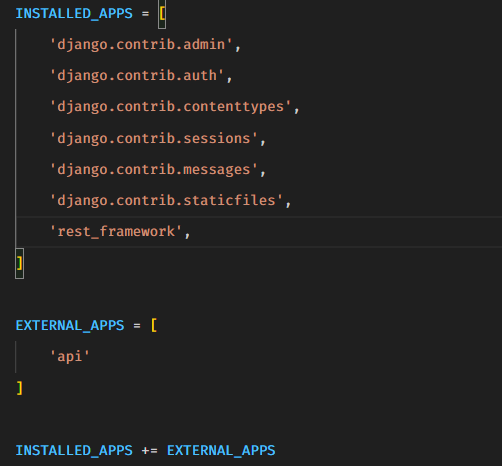
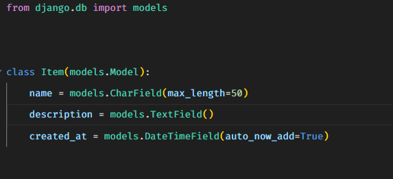
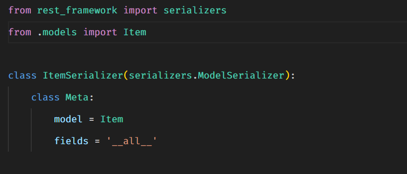
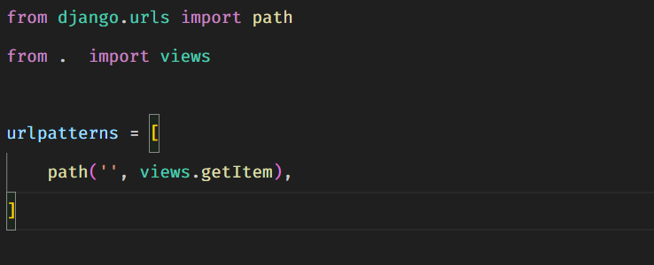
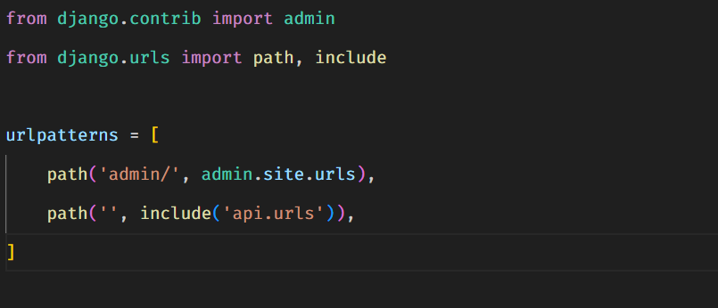
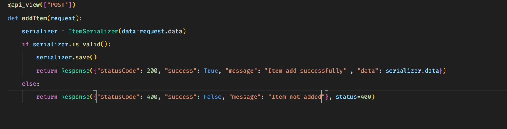
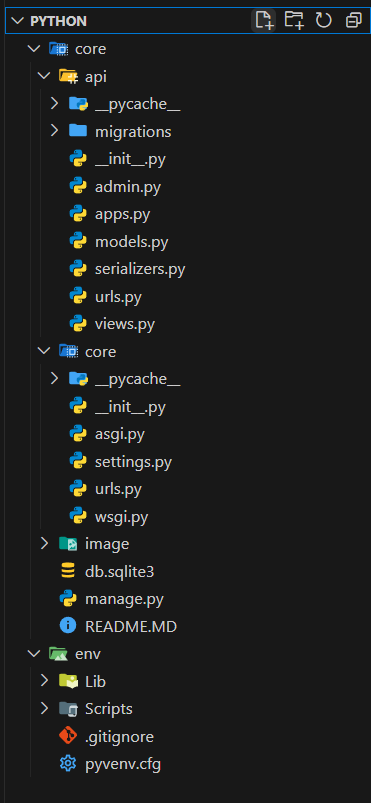

# Make Django Project

## 1. Make virtual envirenment

`virtualenv env`

## 2. Activate environment

`cd env && cd Scripts && activate`

## 3. Install django in this environment

`pip install Django`

## 4. Make project

`django-admin startproject project_name`

## 5. Run server

`python manage.py runserver`

## 6. Create app add in the setting.py file

`python manage.py startapp app_name`

## 7. Install djangorestframework for make rest api using rest_framework and add in the INSTALLED_APP in the setting.py file

`pip install djangorestframework`

## 8. Make model in the models.py file

## 9. Make migration using

`python manage.py makemigrations`

`python manage.py migrate`

## 10. Make serializer for the model

## 11. Write logic in the views file

## 12. Add urls in the api.urls.py file

## 13. Add api urls in the urls.py file

## 14. Add item views

## Folder structure

